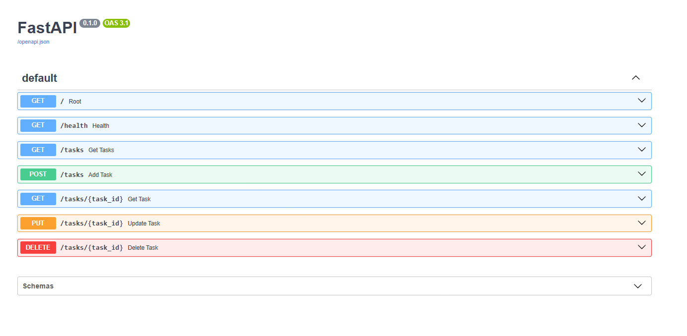

# Task CRUD API

A lightweight RESTful CRUD (Create, Read, Update, Delete) API built with **FastAPI** and **Pydantic**.

---

## 🚀 Features & Endpoints

| Method | Endpoint | Description | Status Code |
| :--- | :--- | :--- | :--- |
| `GET` | `/` | API root & metadata | `200 OK` |
| `GET` | `/health` | Health check endpoint | `200 OK` |
| `GET` | `/tasks` | List all tasks | `200 OK` |
| `POST` | `/tasks` | Create a new task | `201 Created` |
| `GET` | `/tasks/{task_id}` | Retrieve a task by ID | `200 OK` / `404 Not Found` |
| `PUT` | `/tasks/{task_id}` | Update task title and/or done status | `200 OK` / `400 Bad Request` / `404 Not Found` |
| `DELETE` | `/tasks/{task_id}` | Remove a task by ID | `204 No Content` / `404 Not Found` |

---

## 🛠️ How to Run

### 1. Start the Development Server
```bash
uv run fastapi dev
```

### 2. Interactive API Documentation (Swagger UI)
Open your browser and navigate to:
[http://localhost:8000/docs](http://localhost:8000/docs)



---

## 🧪 Testing with `curl` (PowerShell)

### 1. List All Tasks
```powershell
curl.exe -i -X GET http://localhost:8000/tasks
```

### 2. Create a Task
```powershell
curl.exe -i -X POST http://localhost:8000/tasks -H "Content-Type: application/json" -d '{"title":"Buy groceries"}'
```

### 3. Get Task by ID
```powershell
curl.exe -i -X GET http://localhost:8000/tasks/4
```

### 4. Update Task (Title & Status)
```powershell
curl.exe -i -X PUT http://localhost:8000/tasks/4 -H "Content-Type: application/json" -d '{"title":"Buy groceries & milk", "done": true}'
```

### 5. Delete Task
```powershell
curl.exe -i -X DELETE http://localhost:8000/tasks/4
```
